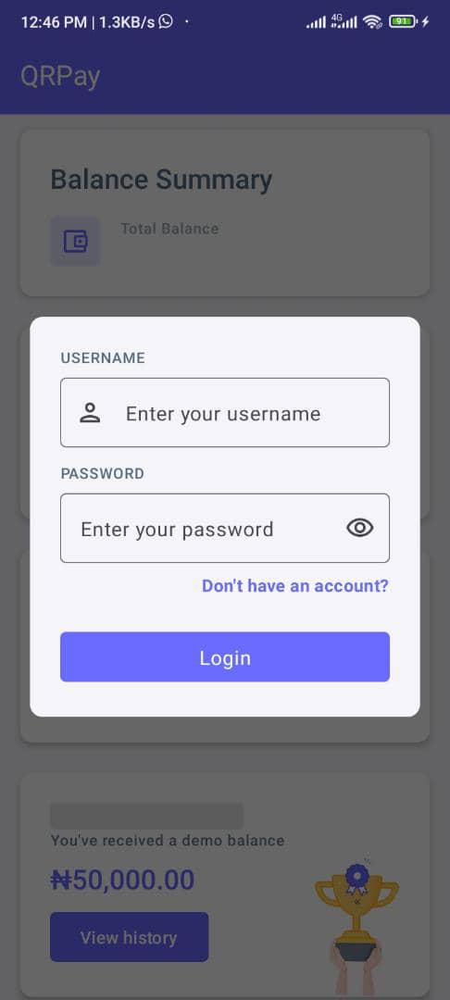
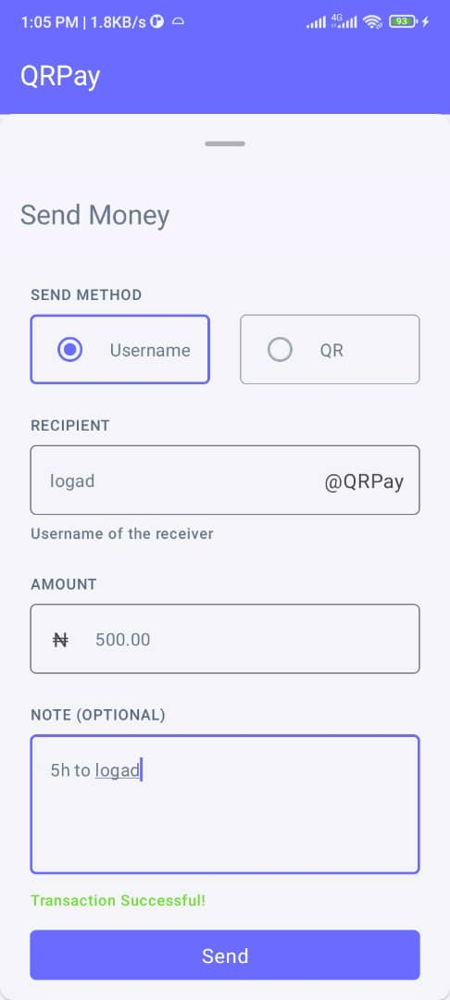
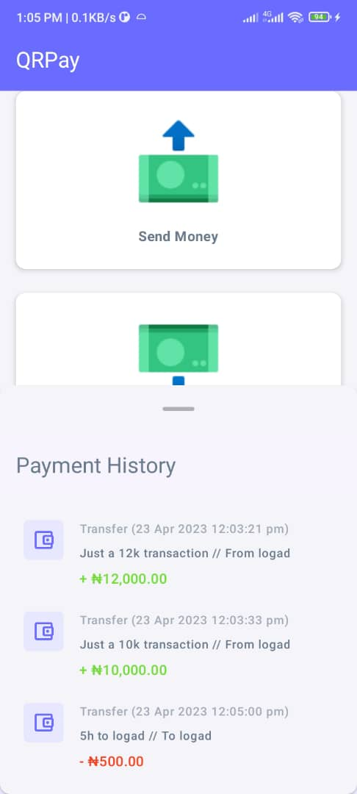

<div id="top"></div>

<!-- PROJECT SHIELDS -->
<!--
*** I'm using markdown "reference style" links for readability.
*** Reference links are enclosed in brackets [ ] instead of parentheses ( ).
*** See the bottom of this document for the declaration of the reference variables
*** for contributors-url, forks-url, etc. This is an optional, concise syntax you may use.
*** https://www.markdownguide.org/basic-syntax/#reference-style-links
-->
<div align="center">

[![Contributors][contributors-shield]][contributors-url]
[![Forks][forks-shield]][forks-url]
[![Stargazers][stars-shield]][stars-url]
[![Issues][issues-shield]][issues-url]
[![MIT License][license-shield]][license-url]

</div>


<!-- PROJECT LOGO -->
<br />
<div align="center">
  <a href="https://github.com/logickoder/qrpay">
    
  </a>

  <h3 align="center">QrPay</h3>
  <p>Based on <a href="https://github.com/michaelthedev/qrpay/">qrpay</a> by <a href="https://github.com/michaelthedev/">michaelthedev</a></p>

  <p align="center">
    <a href="https://appetize.io/app/g0z1zuju8b88vf6bq40xx9t8ym" target="_blank">View Demo</a>
    ·
    <a href="https://github.com/logickoder/qrpay/issues">Report Bug</a>
    ·
    <a href="https://github.com/logickoder/qrpay/issues">Request Feature</a>
  </p>
</div>


<!-- ABOUT THE PROJECT -->

## About The Project

<table>
<tr>
<td valign="top" width="50%">

</td>
<td valign="top" width="50%">

</td>
</tr>
<tr>
<td valign="top" width="50%">

</td>
<td valign="top" width="50%">

</td>
</tr>
</table>

Very simple

* You register with your username, and your details are saved in the backend
* You login with your username
* Your details are fetched from the backend and updated at an interval
* Use your username to receive money or use your QR code
* Send money by entering the recipient's username or scanning their QR code

The api documentation for this project backend is hosted at

* [API documentation](http://qrpay-logickoder.azurewebsites.net/swagger-ui.html) (it may take
  sometime to load due to the azure virtual machine booting up)

<p align="right">(<a href="#top">back to top</a>)</p>

### Built With

<!-- This section should list any major frameworks/libraries used to bootstrap your project. Leave any add-ons/plugins for the acknowledgements section. Here are a few examples. -->

* [Jetpack Compose](https://developer.android.com/jetpack/compose) for the client UI
* [Jetpack Room](https://developer.android.com/jetpack/androidx/releases/room) for storing data
  locally on the client
* [Spring boot](https://spring.io/) for building the backend
* [Ktor](https://ktor.io/) for communicating with the backend from the client

<p align="right">(<a href="#top">back to top</a>)</p>

## Installation

Clone the repository from Github:

``` bash
git clone https://github.com/logickoder/qrpay.git
```

Navigate to the project directory:

``` bash
cd qrpay
```

For the spring boot backend (localhost:8080):

``` bash
./gradlew :api:bootRun
```

For the android app:

``` bash
./gradlew :app:assembleDebug
```

<p align="right">(<a href="#top">back to top</a>)</p>

<!-- CONTRIBUTING -->

## Contributing

Contributions are what make the open source community such an amazing place to learn, inspire, and
create. Any contributions you make are **greatly appreciated**.

If you have a suggestion that would make this better, please fork the repo and create a pull
request. You can also simply open an issue with the tag "enhancement".
Don't forget to give the project a star! Thanks again!

1. Fork the Project
2. Create your Feature Branch
3. Commit your Changes
4. Push to the Branch
5. Open a Pull Request

<p align="right">(<a href="#top">back to top</a>)</p>


<!-- LICENSE -->
## License

Distributed under the MIT License.

<p align="right">(<a href="#top">back to top</a>)</p>


<!-- CONTACT -->
## Contact
logickoder - [@logickoder](https://twitter.com/logickoder) - chukwudumebiorazulike@gmail.com

<p align="right">(<a href="#top">back to top</a>)</p>

<!-- MARKDOWN LINKS & IMAGES -->
<!-- https://www.markdownguide.org/basic-syntax/#reference-style-links -->
[contributors-shield]: https://img.shields.io/github/contributors/logickoder/qrpay.svg?style=for-the-badge
[contributors-url]: https://github.com/logickoder/qrpay/graphs/contributors
[forks-shield]: https://img.shields.io/github/forks/logickoder/qrpay.svg?style=for-the-badge
[forks-url]: https://github.com/logickoder/qrpay/network/members
[stars-shield]: https://img.shields.io/github/stars/logickoder/qrpay.svg?style=for-the-badge
[stars-url]: https://github.com/logickoder/qrpay/stargazers
[issues-shield]: https://img.shields.io/github/issues/logickoder/qrpay.svg?style=for-the-badge
[issues-url]: https://github.com/logickoder/qrpay/issues
[license-shield]: https://img.shields.io/github/license/logickoder/qrpay.svg?style=for-the-badge
[license-url]: https://github.com/logickoder/qrpay/blob/main/LICENSE