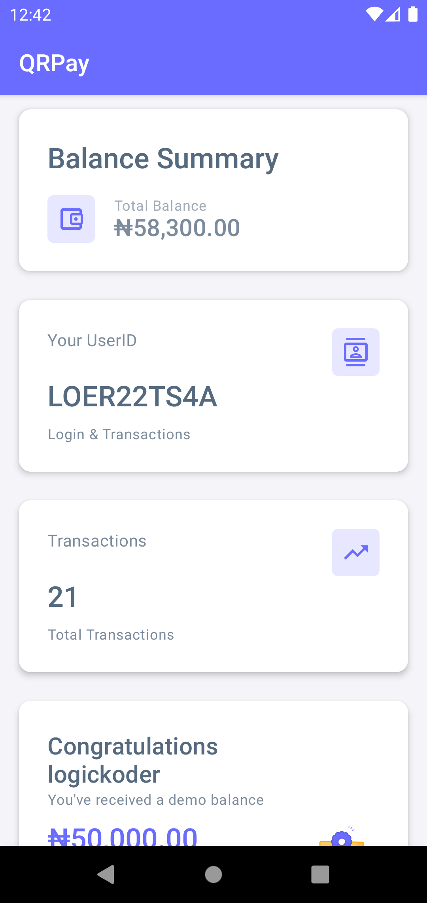

<!-- PROJECT SHIELDS -->
<!--
*** I'm using markdown "reference style" links for readability.
*** Reference links are enclosed in brackets [ ] instead of parentheses ( ).
*** See the bottom of this document for the declaration of the reference variables
*** for contributors-url, forks-url, etc. This is an optional, concise syntax you may use.
*** https://www.markdownguide.org/basic-syntax/#reference-style-links
-->
[![Contributors][contributors-shield]][contributors-url]
[![Forks][forks-shield]][forks-url]
[![Stargazers][stars-shield]][stars-url]
[![Issues][issues-shield]][issues-url]
[![MIT License][license-shield]][license-url]

<!-- PROJECT LOGO -->
 

  

  <h3 align="center">QrPay</h3>

  

    <a href="https://appetize.io/embed/g0z1zuju8b88vf6bq40xx9t8ym">View Demo</a>
    ·
    <a href="https://github.com/logickoder/qrpay/issues">Report Bug</a>
    ·
    <a href="https://github.com/logickoder/qrpay/issues">Request Feature</a>
  

<!-- ABOUT THE PROJECT -->
## About The Project

Very simple
* You register, the system generates a unique ID
* You login with your unique ID
* Your details are fetched from the API and updated at an interval
* Use your userID to receive money or use your QR code
* Send money by entering the receipients user id or scanning their code

### Built With

This section should list any major frameworks/libraries used to bootstrap your project. Leave any add-ons/plugins for the acknowledgements section. Here are a few examples.

* [Jetpack Compose](https://developer.android.com/jetpack/compose)

(<a href="#top">back to top</a>)

<!-- CONTRIBUTING -->
## Contributing

Contributions are what make the open source community such an amazing place to learn, inspire, and create. Any contributions you make are **greatly appreciated**.

If you have a suggestion that would make this better, please fork the repo and create a pull request. You can also simply open an issue with the tag "enhancement".
Don't forget to give the project a star! Thanks again!

1. Fork the Project
2. Create your Feature Branch
3. Commit your Changes
4. Push to the Branch
5. Open a Pull Request

(<a href="#top">back to top</a>)

<!-- LICENSE -->
## License

Distributed under the MIT License.

(<a href="#top">back to top</a>)

<!-- CONTACT -->
## Contact
logickoder - [@logickoder](https://twitter.com/logickoder) - chukwudumebiorazulike@gmail.com

(<a href="#top">back to top</a>)

<!-- MARKDOWN LINKS & IMAGES -->
<!-- https://www.markdownguide.org/basic-syntax/#reference-style-links -->
[contributors-shield]: https://img.shields.io/github/contributors/logickoder/qrpay.svg?style=for-the-badge
[contributors-url]: https://github.com/logickoder/qrpay/graphs/contributors
[forks-shield]: https://img.shields.io/github/forks/logickoder/qrpay.svg?style=for-the-badge
[forks-url]: https://github.com/logickoder/qrpay/network/members
[stars-shield]: https://img.shields.io/github/stars/logickoder/qrpay.svg?style=for-the-badge
[stars-url]: https://github.com/logickoder/qrpay/stargazers
[issues-shield]: https://img.shields.io/github/issues/logickoder/qrpay.svg?style=for-the-badge
[issues-url]: https://github.com/logickoder/qrpay/issues
[license-shield]: https://img.shields.io/github/license/logickoder/qrpay.svg?style=for-the-badge
[license-url]: https://github.com/logickoder/qrpay/blob/main/LICENSE.txt
[product-screenshot]: screenshot.jpg
